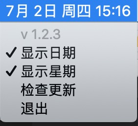
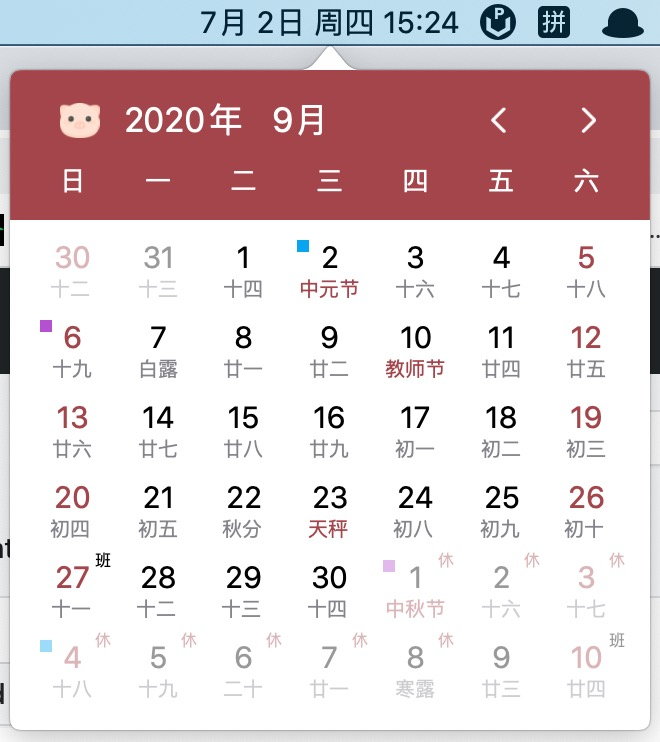
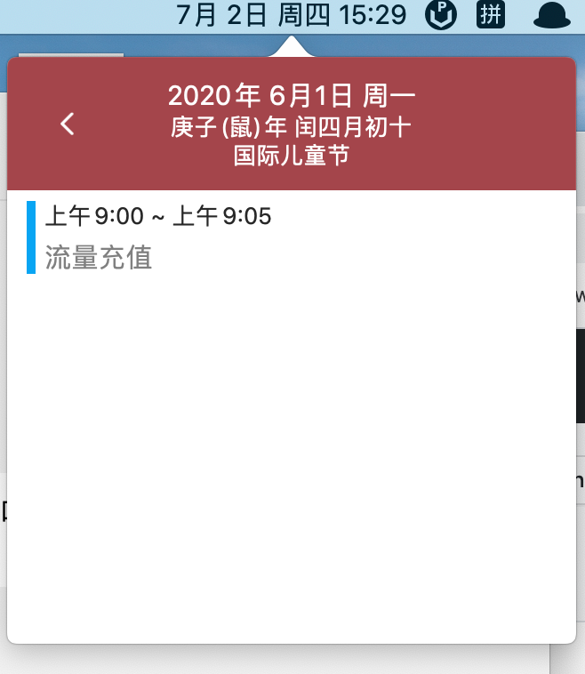
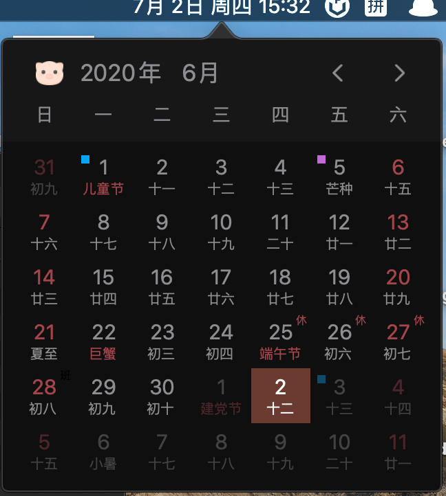
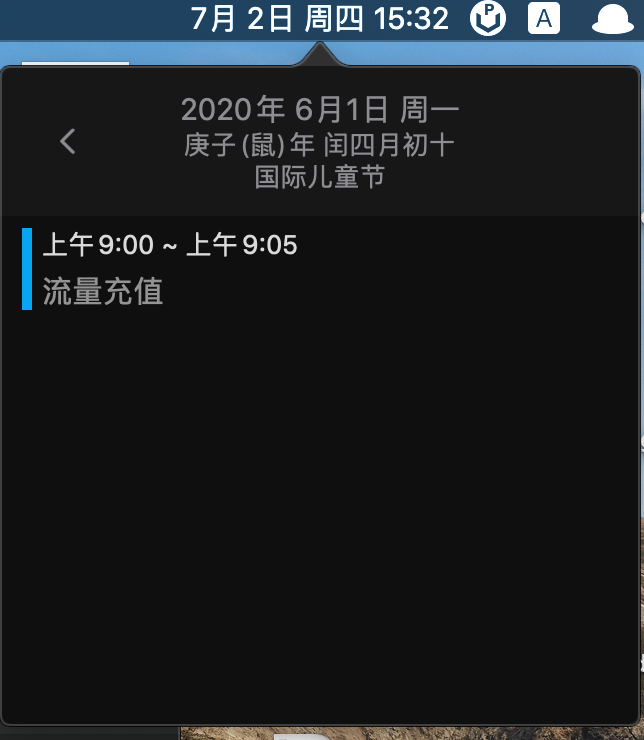

# 这是日历啊
这是一个显示时间和日历的App，支持夜间模式、在线更新。
- [下载地址](https://github.com/ZzzM/LunarCalendar/releases/download/1.2.3/default.zip)
- 运行环境：macOS 10.15.0 或以上
  
# 预览
## 时间
- 默认显示时间样式

## 菜单（右键点击"时间"弹出）

## 日历（左键点击"时间"弹出）
- 日间模式

- 夜间模式

