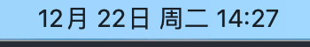
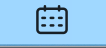
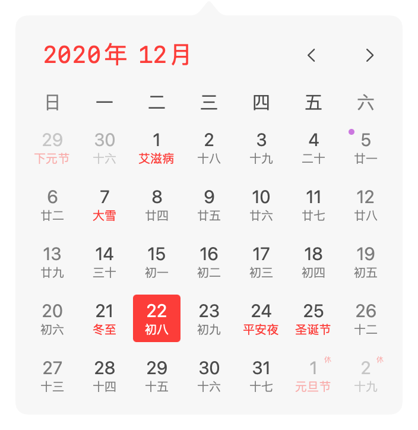
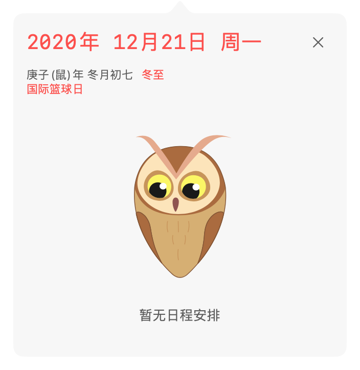
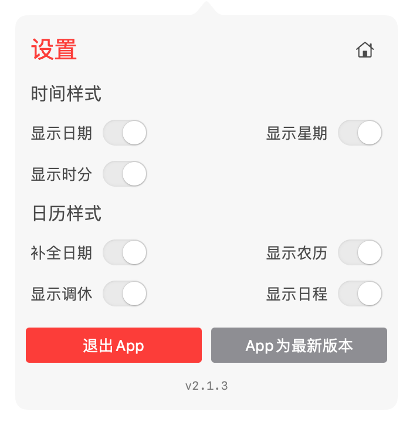
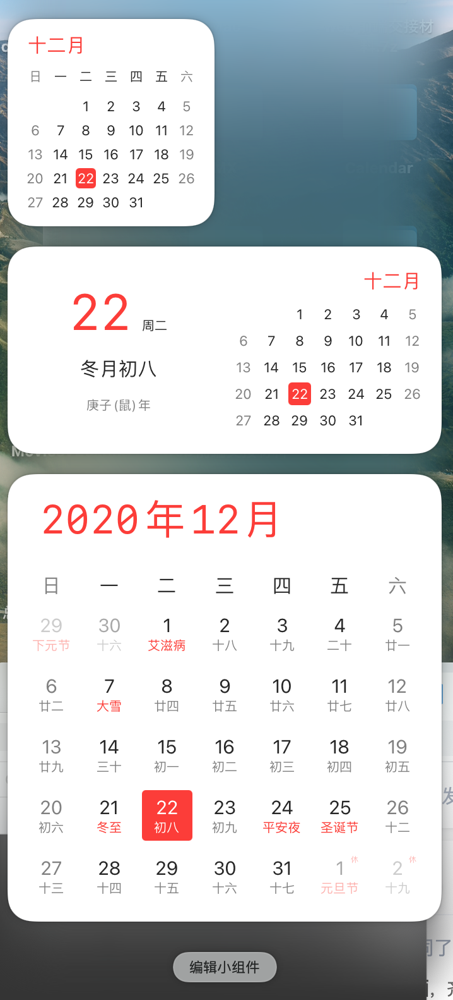

# 这是日历啊
一款简洁的日历、时间显示工具。
- [下载地址](https://github.com/ZzzM/LunarCalendar/releases/download/2.1.2/calendar.zip)
- 运行环境：macOS 11.0 或以上
- 在线更新：需要将解压好的App放至应用程序文件夹

# 记录
| 版本 |  说明 |
| ----  | ---- |
| 2.1.2 | 优化暗黑模式下显示效果 |
| 2.1.1 | 界面调整 优化交互 |
| 2.1.0 | 界面调整 优化交互|
| 2.0.0 | 全新UI 更新2021年法定假日 支持 macOS Big Sur 小组件|

# 预览

## 时间
*支持多种样式*

## 日历
*左键弹出*

## 设置
*右键弹出*

## 小组件

