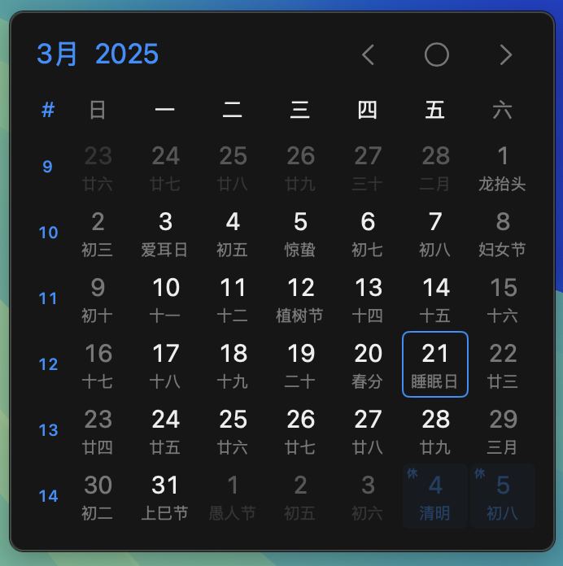
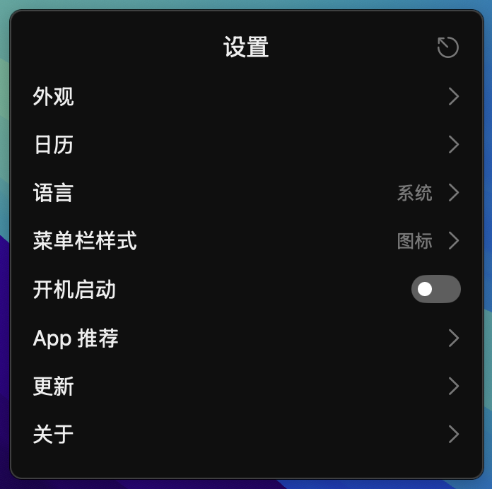
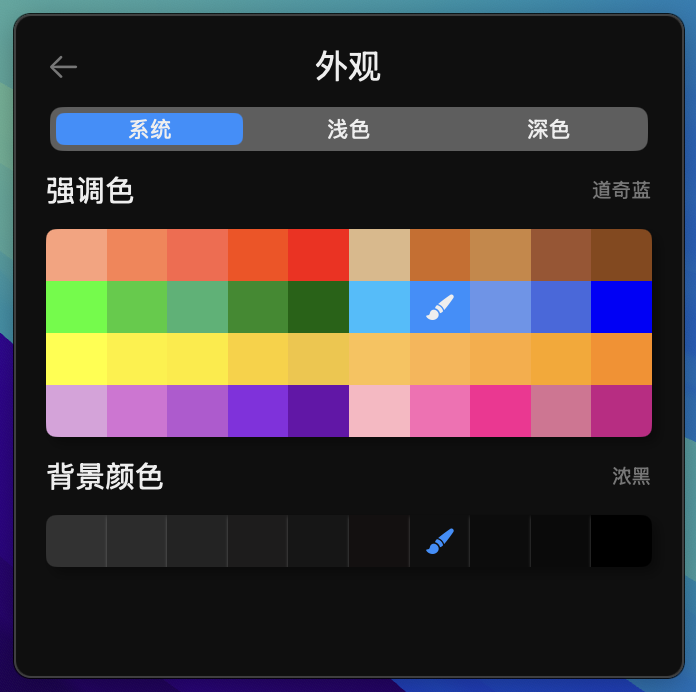
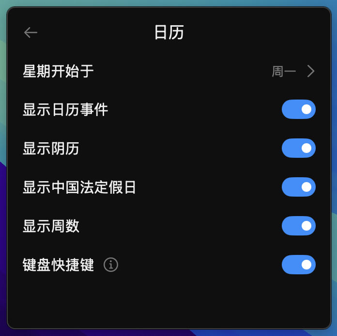
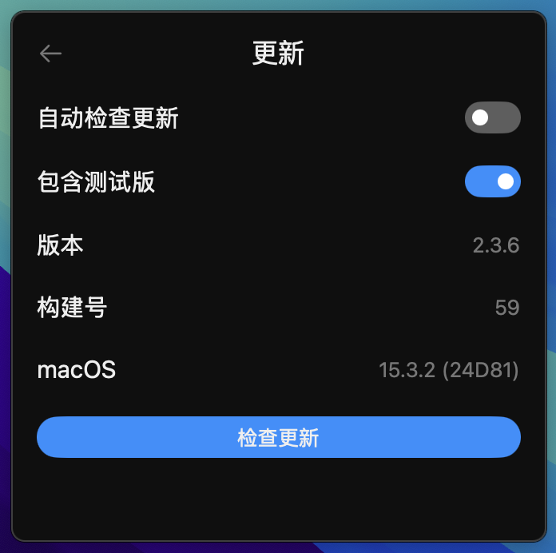
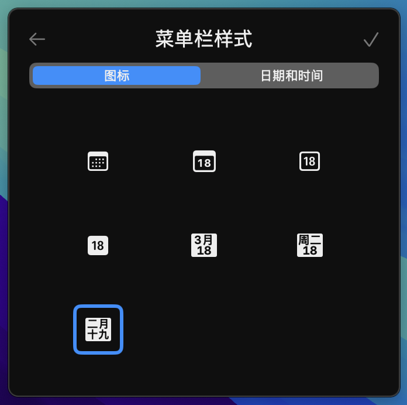
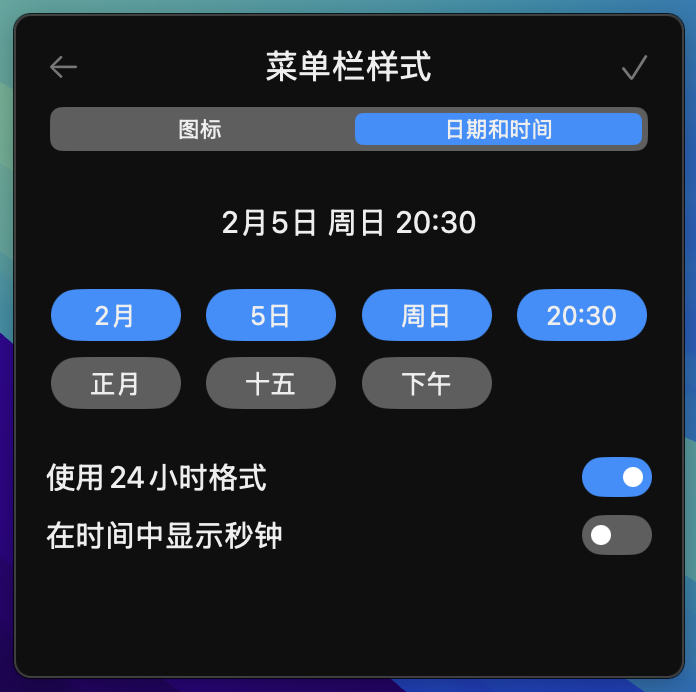
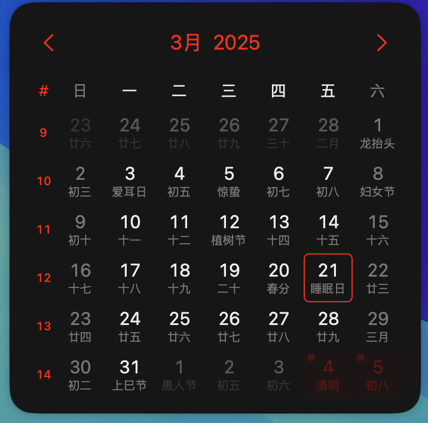
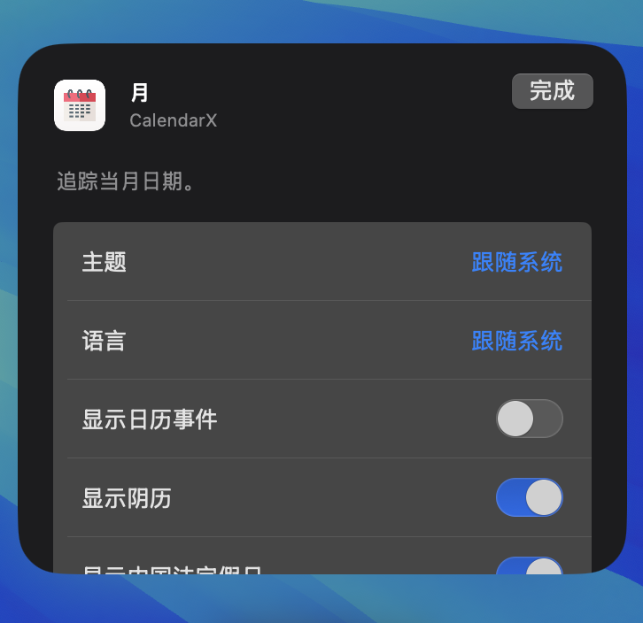

<h1 >

<p>CalendarX</p>
<a href="https://github.com/ZzzM/CalendarX/releases/latest"></a>
<a href="https://github.com/ZzzM/CalendarX/releases/latest"></a>
<a href="https://raw.githubusercontent.com/ZzzM/CalendarX/master/LICENSE"></a>
<a href="https://zzzm.github.io/2022/04/29/calendarx/">

</a>
</h1>

A lightweight macOS app for displaying calendar and time 

## Features
- [x] Chinese statutory holidays and other festivals
- [x] Custom menubar styles (icon, date & time）
- [x] Dark mode
- [x] Localization (简体中文、English)
- [x] Widget / Interactive Widget / KeyboardShortcut
- [x] SwiftUI / Async / Await

## Compatibility
- Requires **macOS 11.0** or later

## Changelogs
- [简体中文](changelogs/CHANGELOG_SC.md)
- [English](changelogs/CHANGELOG.md)

## Snapshots

### Calendar 

> [!NOTE]
> Left click the menubar item to open it

 

### Settings

> [!NOTE]
> Right click the menubar item to open it
    
  

  

> [!TIP]
> Drag and drop to edit `Date & Time Style`

  

### Widget / Interactive Widget ( *macOS 14.0 +* )

 
    
## FAQ

1. **"CalendarX.dmg" can't be opened.**
    
     

1. **"CalendarX" can't be opened.**
    
     

    **Or**
   
   open `Terminal` and run
    
    ``` shell
    sudo xattr -r -d com.apple.quarantine /Applications/CalendarX.app
    ```
## Dependencies

- [Sparkle](https://github.com/sparkle-project/Sparkle)
- [LaunchAtLogin](https://github.com/sindresorhus/LaunchAtLogin)
- [Schedule](https://github.com/luoxiu/Schedule)  
- [Swift Algorithms](https://github.com/apple/swift-algorithms)
