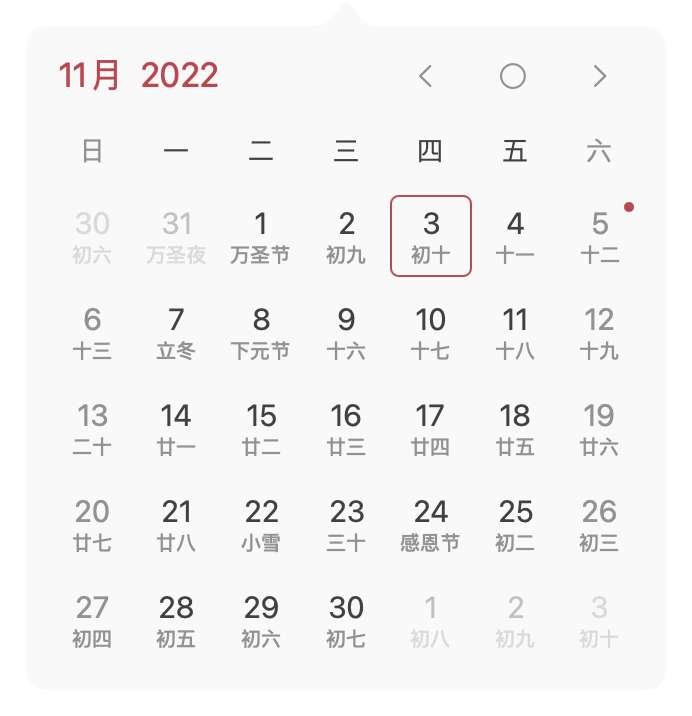
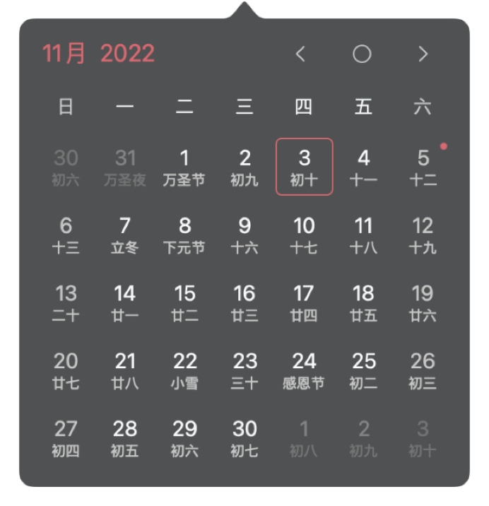
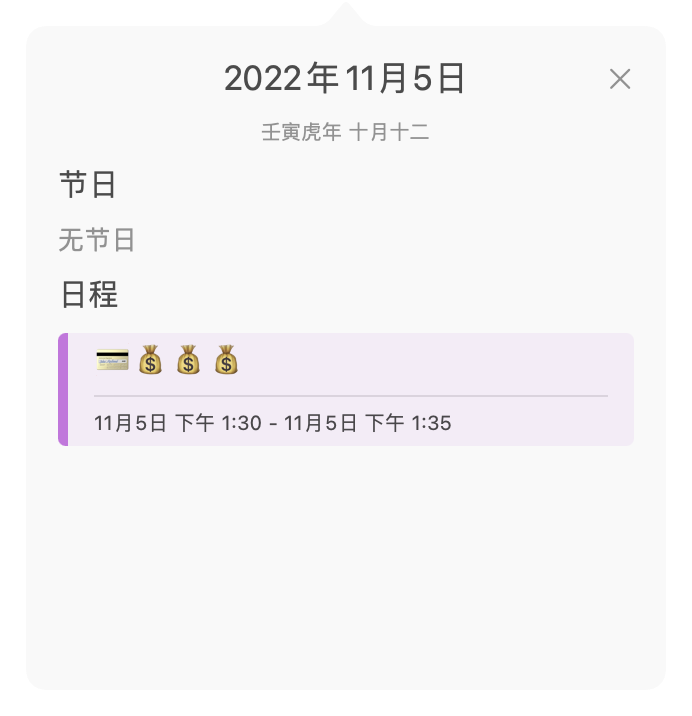
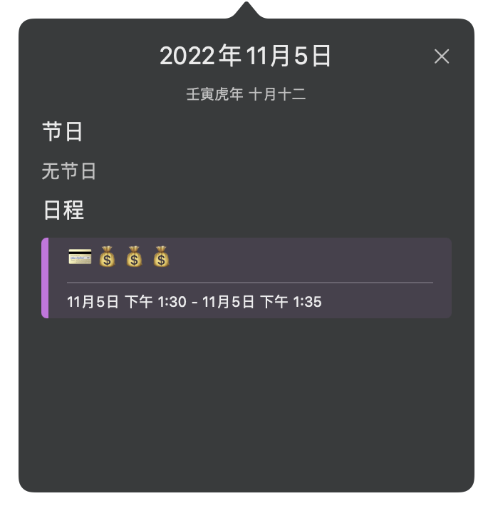

<h1>
CalendarX 

</h1>

A lightweight macOS App for displaying calendar and time 

## Features
- [x] Chinese statutory holidays and other festivals
- [x] Custom menubar styles (default, text, date & time）
- [x] Multiple tint
- [x] Dark mode
- [x] Localization (简体中文、English)
- [x] SwiftUI / Async / Await

## Compatibility
- Requires **macOS 11.0** or later

## Changelogs
- [简体中文](changelogs/CHANGELOG_SC.md)
- [English](changelogs/CHANGELOG.md)

## Snapshots
- Calendar - left click to show

 

 

- Settings - right click to show

 

- Menubar - custom styles (default, text, date & time）

  
 
  
## Dependencies
- [Sparkle](https://github.com/sparkle-project/Sparkle)
- [WrappingHStack](https://github.com/dkk/WrappingHStack)
- [LaunchAtLogin](https://github.com/sindresorhus/LaunchAtLogin)
- [Schedule](https://github.com/luoxiu/Schedule)
